# GA/T 2380—2026 数据安全基本要求 COU 拆解报告

> **标准全称**：信息安全技术 网络安全等级保护数据安全基本要求
> **标准编号**：GA/T 2380—XXXX（报批稿）
> **发布单位**：中华人民共和国公安部
> **拆解日期**：2026-06-16
> **拆解方法**：EZcompliance COU（Compliance Obligation Unit）方法论
> **配合使用标准**：GB/T 22239—2019《信息安全技术 网络安全等级保护基本要求》

---

## 目录

1. [方法论说明](#一方法论说明)
2. [总体统计](#二总体统计)
3. [按等级分布](#三按等级分布)
4. [按安全域分布](#四按安全域分布)
5. [按数据环节分布](#五按数据环节分布)
6. [标准演进分析](#六标准演进分析)
7. [逐级详细拆解](#七逐级详细拆解)
8. [场景聚合视图](#八场景聚合视图)
9. [跨标准关联分析](#九跨标准关联分析)
10. [合规优先级矩阵](#十合规优先级矩阵)
11. [输出文件索引](#十一输出文件索引)

---

## 一、方法论说明

### 1.1 COU 理念

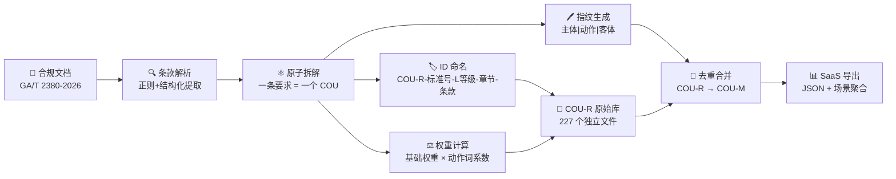

COU（Compliance Obligation Unit，合规义务单元）是 EZcompliance 项目定义的合规文档原子化拆解单位。每条 COU 满足：

| 原则 | 说明 |
|------|------|
| **原子性** | 一条 COU = 一个不可再分的合规动作（主体 + 动作 + 客体） |
| **可溯源** | 携带完整来源追溯链（标准号 → 等级 → 章节 → 条款号） |
| **可度量** | 基于等级和动作强制程度的权重体系，可量化比较 |
| **可去重** | 通过指纹实现跨标准/跨等级合并，消除冗余 |

### 1.2 COU ID 命名规则

```
COU-R-{标准号}-L{等级}-{章节}-{条款}
```

| 示例 ID | 含义 |
|---------|------|
| `COU-R-2380-L3-6.5.1-a` | 第3级，第6.5.1节（身份鉴别），条款a |
| `COU-R-2380-L2-5.3-X` | 第2级，第5.3节（安全计算环境），无子条款编号 |
| `COU-R-2380-L4-7.6.1.2-X` | 第4级，第7.6.1.2节（重要/核心系统溯源），无子条款编号 |

### 1.3 权重体系

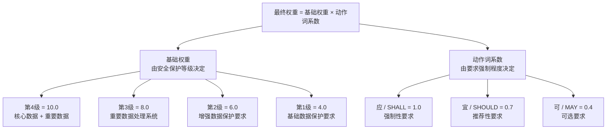

| 等级 | 基础权重 | GB/T 22239 对应 | 数据安全保护对象 |
|------|---------|----------------|-----------------|
| **第4级** | 10.0 | 强制保护级 | 核心数据 + 重要数据 |
| **第3级** | 8.0 | 监督保护级 | 重要数据 |
| **第2级** | 6.0 | 指导保护级 | 一般数据（增强要求） |
| **第1级** | 4.0 | 自主保护级 | 一般数据（基础要求） |

| 动作词 | 英文 | 系数 | 语义 |
|--------|------|------|------|
| **应** | SHALL | 1.0 | 必须满足，不可豁免 |
| **宜** | SHOULD | 0.7 | 建议满足，有合理理由可豁免 |
| **可** | MAY | 0.4 | 允许满足，完全可选 |

### 1.4 指纹与去重机制

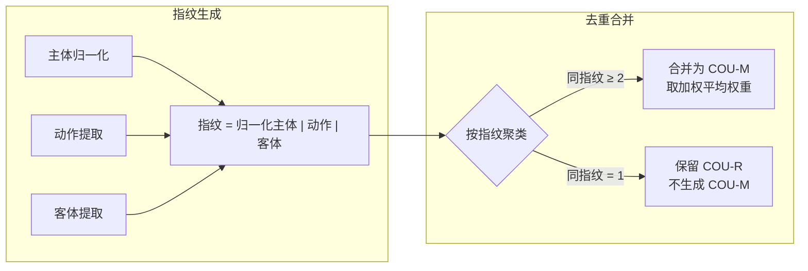

| 归一化主体 | 原始主体示例 |
|-----------|-------------|
| 网络运营者 | 运营者、网络安全等级保护对象运营者 |
| 数据控制者 | 个人信息处理者、数据处理者、重要数据处理者 |
| 服务提供者 | 受托处理者、云服务商、供应方、境外接收方 |
| 数据安全管理者 | 数据安全负责人、数据安全管理员、数据安全审计员 |

### 1.5 安全域映射

本标准在 GB/T 22239—2019 十域基础上，新增数据安全特化域：

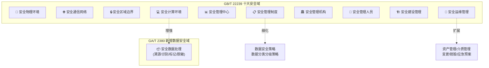

---

## 二、总体统计

### 2.1 核心指标仪表盘

|          |          |          |          |
|:--------:|:--------:|:--------:|:--------:|
| **250**<br/>总 COU 数 | **239**<br/>强制要求 (95.6%) | **11**<br/>推荐要求 (4.4%) | **0**<br/>可选要求 |
| **4**<br/>覆盖等级 | **38**<br/>安全子域 | **20**<br/>数据环节 | **6**<br/>引用标准 |

### 2.2 动作词占比

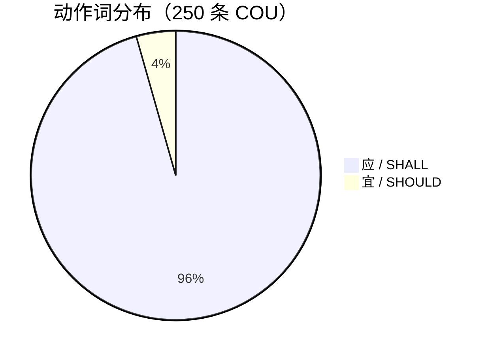

### 2.3 权重分布

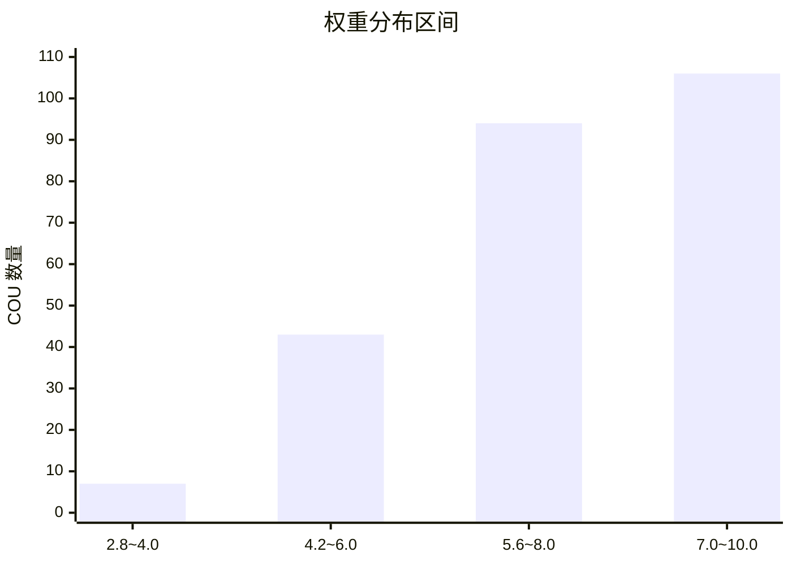

| 权重区间 | COU 数量 | 占比 | 典型场景 |
|---------|---------|------|---------|
| **8.0 ~ 10.0** | 107 | 42.8% | 第4级强制要求（核心数据保护） |
| **6.0 ~ 8.0** | 86 | 34.4% | 第3级强制要求（重要数据保护） |
| **4.0 ~ 6.0** | 42 | 16.8% | 第2级强制要求（增强保护） |
| **2.8 ~ 4.0** | 15 | 6.0% | 第1级 + 推荐要求 |

### 2.4 文档元数据

| 要素 | 内容 |
|------|------|
| **标准号** | GA/T 2380—XXXX |
| **阶段** | 报批稿 |
| **提出单位** | 公安部网络安全保卫局 |
| **归口单位** | 公安部信息系统安全标准化委员会 |
| **起草单位** | 公安部第三研究所、公安部网络安全保卫局、阿里巴巴、公安部第一研究所、中国电子科技集团第十五研究所、蚂蚁科技、观安信息、亚信安全、深圳网安、美创科技、神舟信息安全、快手、慧盾、奇安信、江南天安、问天量子、天融信（共 18 家） |
| **引用标准** | GB 17859—1999、GB/T 22239—2019、GB/T 22240—2020、GB/T 25069—2022、GB/T 43697—2024、GB/T 45574—2025 |
| **术语定义** | 数据安全、重要数据、核心数据、一般数据、数据血缘、敏感数据、数据处理、数据供应链（8 项） |

---

## 三、按等级分布

### 3.1 等级递增全景

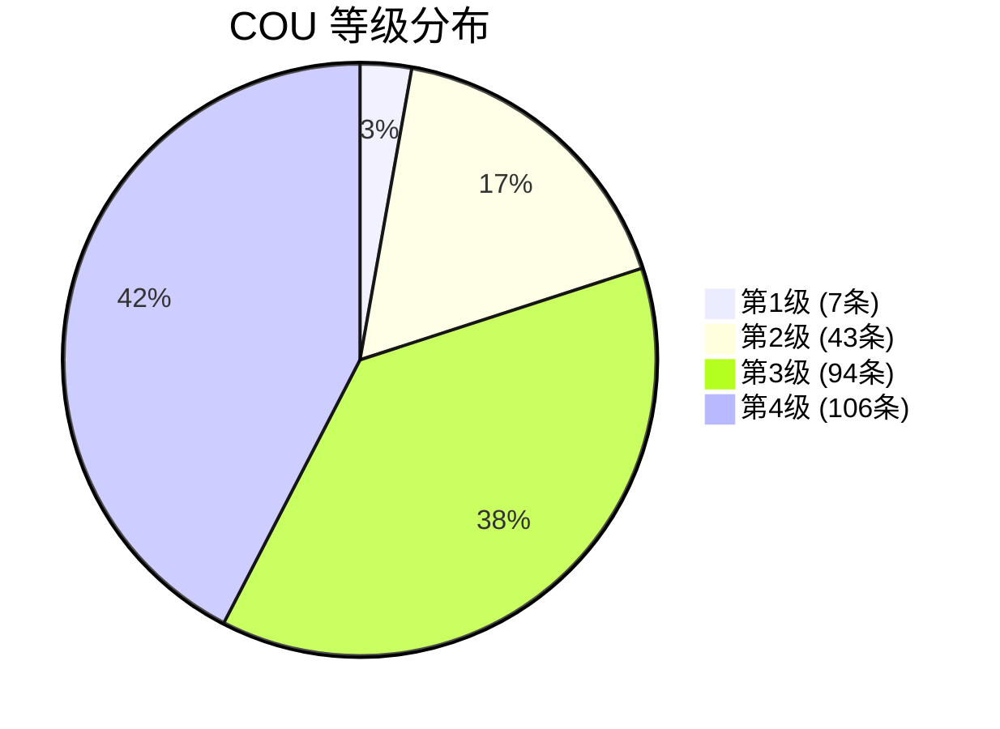

### 3.2 等级 COU 构成

| 等级 | 应/SHALL | 宜/SHOULD | 合计 | 占比 | 权重区间 | GB/T 22239 |
|------|---------|----------|------|------|---------|-----------|
| **第1级** | 5 | 2 | **7** | 2.8% | 2.8 ~ 4.0 | 第6章 |
| **第2级** | 41 | 2 | **43** | 17.2% | 4.2 ~ 6.0 | 第7章 |
| **第3级** | 92 | 2 | **94** | 37.6% | 5.6 ~ 8.0 | 第8章 |
| **第4级** | 101 | 5 | **106** | 42.4% | 7.0 ~ 10.0 | 第9章 |
| **第5级** | — | — | — | — | — | 略 |
| **合计** | **239** | **11** | **250** | 100% | — | — |

### 3.3 等级递增速率

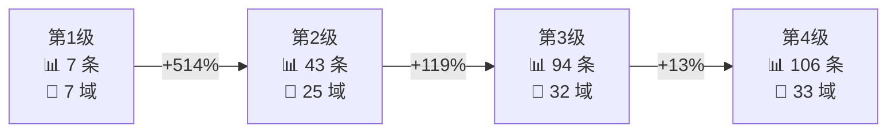

| 等级跨越 | 增长幅度 | 新增安全域 | 关键变化 |
|---------|---------|-----------|---------|
| **L1 → L2** | **+514%** | 物理环境、安全审计、数据备份恢复、数据溯源、数据脱敏、资产管理、介质管理、变更管理、应急预案 | 从"制度框架"跃升到"体系化技术保护" |
| **L2 → L3** | **+119%** | 通信网络、区域边界、安全管理中心、入侵防范、剩余信息保护、数据识别、数据标记、安全事件处置 | 引入"重要数据"独立轨道，建立双轨制 |
| **L3 → L4** | **+13%** | 核心数据轨道、人员离岗审计、多人共管、供应链评估、数据资产地图、态势感知 | 引入"核心数据"第三轨道，技术从"校验或密码"升级为"密码" |

### 3.4 各等级安全域覆盖热力

| 安全域 | L1 | L2 | L3 | L4 |
|--------|:--:|:--:|:--:|:--:|
| 访问控制 | | ██ | ██████ | ████████ |
| 身份鉴别 | | ██ | ████ | ████████ |
| 数据完整性 | | █ | ███ | ██████ |
| 数据保密性 | | █ | ███ | ██████ |
| 数据备份恢复 | | ███ | ███ | ███ |
| 安全审计 | | █ | ██ | ██ |
| 入侵防范 | | | ██ | ████ |
| 恶意代码防范 | | █ | █ | ██ |
| 个人信息保护 | | █ | ██ | ██ |
| 剩余信息保护 | | | ██ | ██ |
| 安全物理环境 | | ██ | ███ | ███ |
| 安全通信网络 | | | █ | ██ |
| 安全区域边界 | | | █ | █ |
| 数据溯源 | | █ | ███ | ███ |
| 数据识别 | | | ██ | ███ |
| 数据标记 | | | ██ | ██ |
| 数据脱敏 | | █ | ██ | ██ |
| 安全管理中心 | | | ██████ | ████████ |
| 安全管理制度 | █ | ████ | ████████ | ████████ |
| 安全管理机构 | ██ | █████ | ██████████ | ████████████ |
| 安全管理人员 | █ | ████ | ████████ | ██████████ |
| 安全建设管理 | █ | ████ | █████ | ██████ |
| 安全运维管理 | █ | ██████████ | ████████████████ | ██████████████████ |

> █ = ~1 COU（热力值 = COU数量 × 权重 / 10 归一化）

---

## 四、按安全域分布

### 4.1 安全域 COU 总量排名（降序）

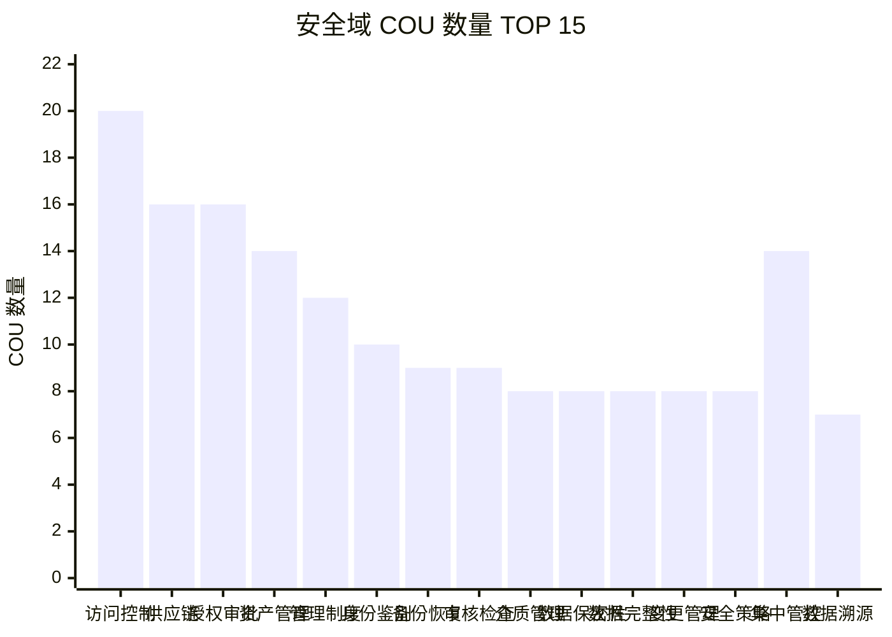

### 4.2 完整安全域统计

| 排名 | 安全域 | 应 | 宜 | 合计 | 等级覆盖 | 主要数据分类 |
|------|--------|---|---|------|---------|-------------|
| 1 | 访问控制 | 20 | 0 | **20** | L2,3,4 | 全部 |
| 2 | 安全建设管理（供应链） | 16 | 0 | **16** | L1,2,3,4 | 全部 |
| 2 | 授权和审批 | 15 | 1 | **16** | L1,2,3,4 | 全部 |
| 4 | 资产管理 | 14 | 0 | **14** | L2,3,4 | 全部 |
| 4 | 安全管理中心/集中管控 | 12 | 2 | **14** | L3,4 | 重要/核心数据 |
| 6 | 管理制度 | 12 | 0 | **12** | L2,3,4 | 全部 |
| 7 | 身份鉴别 | 8 | 2 | **10** | L2,3,4 | 全部 |
| 8 | 数据备份恢复 | 9 | 0 | **9** | L2,3,4 | 业务/溯源数据 |
| 8 | 审核和检查 | 9 | 0 | **9** | L2,3,4 | 全部 |
| 10 | 介质管理 | 8 | 0 | **8** | L2,3,4 | 全部 |
| 10 | 数据保密性 | 7 | 1 | **8** | L2,3,4 | 鉴别/敏感/重要/核心 |
| 10 | 数据完整性 | 8 | 0 | **8** | L2,3,4 | 鉴别/业务/审计/配置 |
| 10 | 变更管理 | 8 | 0 | **8** | L2,3,4 | 全部 |
| 10 | 安全策略 | 8 | 0 | **8** | L2,3,4 | 全部 |
| 15 | 数据溯源 | 6 | 1 | **7** | L2,3,4 | 敏感/重要/核心 |
| 15 | 安全意识教育和培训 | 7 | 0 | **7** | L2,3,4 | 全部 |
| 17 | 数据销毁 | 6 | 0 | **6** | L2,3,4 | 全部 |
| 17 | 入侵防范 | 6 | 0 | **6** | L3,4 | 重要/核心 |
| 17 | 岗位设置 | 5 | 1 | **6** | L1,2,3,4 | 全部 |
| 20 | 个人信息保护 | 5 | 0 | **5** | L2,3,4 | 个人信息/生物特征 |
| 20 | 数据识别 | 2 | 3 | **5** | L3,4 | 重要/敏感/核心 |
| 20 | 数据脱敏 | 5 | 0 | **5** | L2,3,4 | 敏感数据 |
| 20 | 应急预案管理 | 5 | 0 | **5** | L2,3,4 | 全部 |
| 20 | 物理访问控制 | 5 | 0 | **5** | L2,3,4 | 门禁/视频/生物特征 |
| 20 | 安全审计 | 5 | 0 | **5** | L2,3,4 | 全部 |
| 20 | 外部人员访问管理 | 5 | 0 | **5** | L2,3,4 | 全部 |
| 27 | 数据标记 | 4 | 0 | **4** | L3,4 | 敏感/重要/核心 |
| 27 | 人员录用 | 4 | 0 | **4** | L3,4 | 全部 |
| 29 | 恶意代码防范 | 3 | 0 | **3** | L2,3,4 | 全部 |
| 29 | 机房监测数据保护 | 3 | 0 | **3** | L2,3,4 | 环境监测数据 |
| 31 | 安全通信网络 | 2 | 0 | **2** | L3,4 | 重要/核心 |
| 31 | 安全区域边界 | 2 | 0 | **2** | L3,4 | 重要/核心 |
| 33 | 人员离岗 | 1 | 0 | **1** | L4 | 全部 |
| 33 | 人员配备（多人共管） | 1 | 0 | **1** | L4 | 全部 |
| 33 | 安全事件处置 | 1 | 0 | **1** | L3,4 | 重要/个人 |
| 33 | 安全数据处理 | 1 | 0 | **1** | L1 | 个人 |
| 33 | 安全运维管理（基础） | 1 | 0 | **1** | L1 | 全部 |
| 33 | 安全管理人员（基础） | 1 | 0 | **1** | L1 | 全部 |
| 33 | 安全管理制度（基础） | 1 | 0 | **1** | L1 | 全部 |

### 4.3 按 GB/T 22239 十域聚合

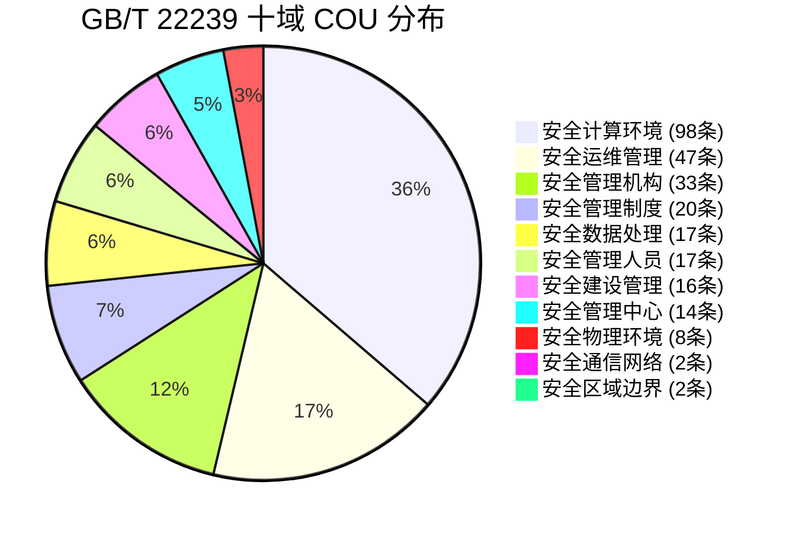

| GB/T 22239 大域 | COU 数 | 占比 | 核心内容 |
|----------------|--------|------|---------|
| **安全计算环境** | 98 | 39.2% | 身份鉴别、访问控制、安全审计、入侵防范、恶意代码防范、数据完整性、数据保密性、备份恢复、剩余信息保护、个人信息保护 |
| **安全运维管理** | 47 | 18.8% | 资产管理、介质管理、变更管理、安全事件处置、应急预案管理、数据销毁 |
| **安全管理机构** | 33 | 13.2% | 岗位设置、授权和审批、审核和检查、人员配备 |
| **安全管理制度** | 20 | 8.0% | 安全策略、管理制度 |
| **安全数据处理** | 17 | 6.8% | 数据溯源、数据识别、数据标记、数据脱敏 |
| **安全管理人员** | 17 | 6.8% | 人员录用、人员离岗、培训、外部人员管理 |
| **安全建设管理** | 16 | 6.4% | 数据供应链安全 |
| **安全管理中心** | 14 | 5.6% | 集中管控、跨境监测、态势感知 |
| **安全物理环境** | 8 | 3.2% | 物理访问控制、机房监测数据保护 |
| **安全通信网络** | 2 | 0.8% | 网络隔离、境内路由保证 |
| **安全区域边界** | 2 | 0.8% | 存储区访问控制 |

> 🔑 **核心发现**：安全计算环境（39.2%）和安全运维管理（18.8%）合计占全部要求的 **58%**，是数据安全保护的两大重心。

---

## 五、按数据环节分布

### 5.1 数据处理全生命周期覆盖图

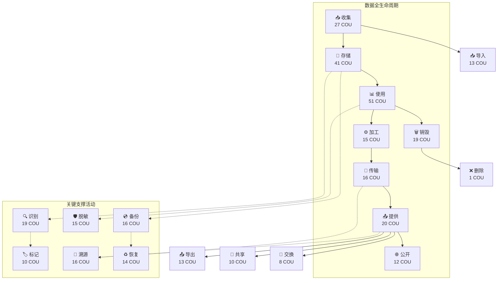

### 5.2 按环节 COU 统计

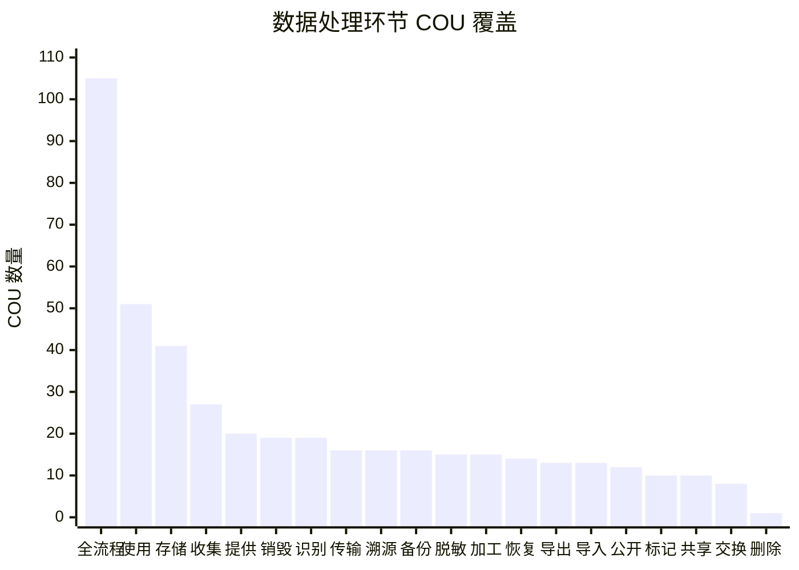

| 数据处理环节 | COU 数 | 占比 | 涉及主要安全域 |
|-------------|--------|------|---------------|
| **数据处理全流程**（跨环节） | 105 | 42.0% | 管理制度、安全审计、安全建设管理 |
| **数据使用** | 51 | 20.4% | 访问控制、数据脱敏、身份鉴别、数据溯源 |
| **数据存储** | 41 | 16.4% | 数据保密性、数据完整性、访问控制、数据标记 |
| **数据收集** | 27 | 10.8% | 数据溯源、数据识别、恶意代码防范、供应链 |
| **数据提供** | 20 | 8.0% | 授权和审批、数据溯源、安全建设管理 |
| **数据销毁** | 19 | 7.6% | 数据销毁、介质管理、数据保密性 |
| **数据识别** | 19 | 7.6% | 数据识别、数据标记、资产管理 |
| **数据传输** | 16 | 6.4% | 数据完整性、数据保密性、安全通信网络 |
| **数据溯源** | 16 | 6.4% | 数据溯源、数据标记 |
| **数据备份** | 16 | 6.4% | 数据备份恢复、数据完整性 |
| **数据脱敏** | 15 | 6.0% | 数据脱敏、个人信息保护 |
| **数据加工** | 15 | 6.0% | 数据识别、恶意代码防范、授权和审批 |
| **数据恢复** | 14 | 5.6% | 数据备份恢复、数据完整性 |
| **数据导出** | 13 | 5.2% | 数据溯源、访问控制、授权和审批 |
| **数据导入** | 13 | 5.2% | 数据完整性、访问控制 |
| **数据公开** | 12 | 4.8% | 授权和审批、审核和检查 |
| **数据标记** | 10 | 4.0% | 数据标记、资产管理 |
| **数据共享** | 10 | 4.0% | 数据溯源、授权和审批 |
| **数据交换** | 8 | 3.2% | 安全审计、授权和审批 |
| **数据删除** | 1 | 0.4% | 个人信息保护 |

---

## 六、标准演进分析

### 6.1 技术强度递进全景图

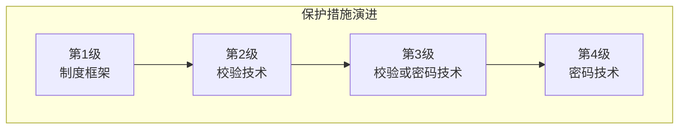

| 保护措施 | 第1级 | 第2级 | 第3级 | 第4级 |
|---------|:----:|:----:|:----:|:----:|
| **完整性保护** | — | 校验技术 | 校验技术**或**密码技术 | **密码技术**（强制） |
| **保密性保护** | — | 必要措施 | 密码技术 | **密码技术** |
| **身份鉴别** | — | 基本鉴别 | 口令+密码组合 | 口令+密码+**生物识别+动态组合** |
| **访问控制粒度** | — | 接口级 | 用户级/进程级→文件/数据库表级 | +**动态细粒度** |
| **安全审计（重要）** | — | — | 操作审计 | +操作结果审计 |
| **数据溯源** | — | 展示溯源（水印） | 源头+导出溯源 | +**处理过程溯源** |
| **数据识别** | — | — | 结构化数据 | **结构化+非结构化** |
| **数据标记** | — | — | 结构化数据 | **结构化+非结构化** |
| **数据备份** | — | 定时批量 | **实时备份** | 实时备份 |
| **入侵防范** | — | — | 检测+报警 | +**实时阻断+内容检测** |
| **介质销毁** | — | 清除/覆盖 | 重复清除与覆盖 | +**消磁+粉碎** |
| **抗抵赖** | — | — | — | **密码技术原发/接收证据** |

### 6.2 数据分类递进

| 数据类别 | L1 | L2 | L3 | L4 |
|---------|:--:|:--:|:--:|:--:|
| 一般数据 | ✓ | ✓ | ✓ | ✓ |
| 敏感数据 | — | ✓ | ✓ | ✓ |
| 个人信息 | ✓ | ✓ | ✓ | ✓ |
| 敏感个人信息 | 去标识化 | 去标识化+批量限制 | 分开存储+限期保存+注销删除 | 同L3 |
| 生物特征信息 | — | — | 密码技术保护 | 密码技术保护 |
| 重要数据 | — | — | ✓ | ✓ |
| 核心数据 | — | — | — | ✓ |

### 6.3 "一般 / 重要 / 核心" 三轨制架构

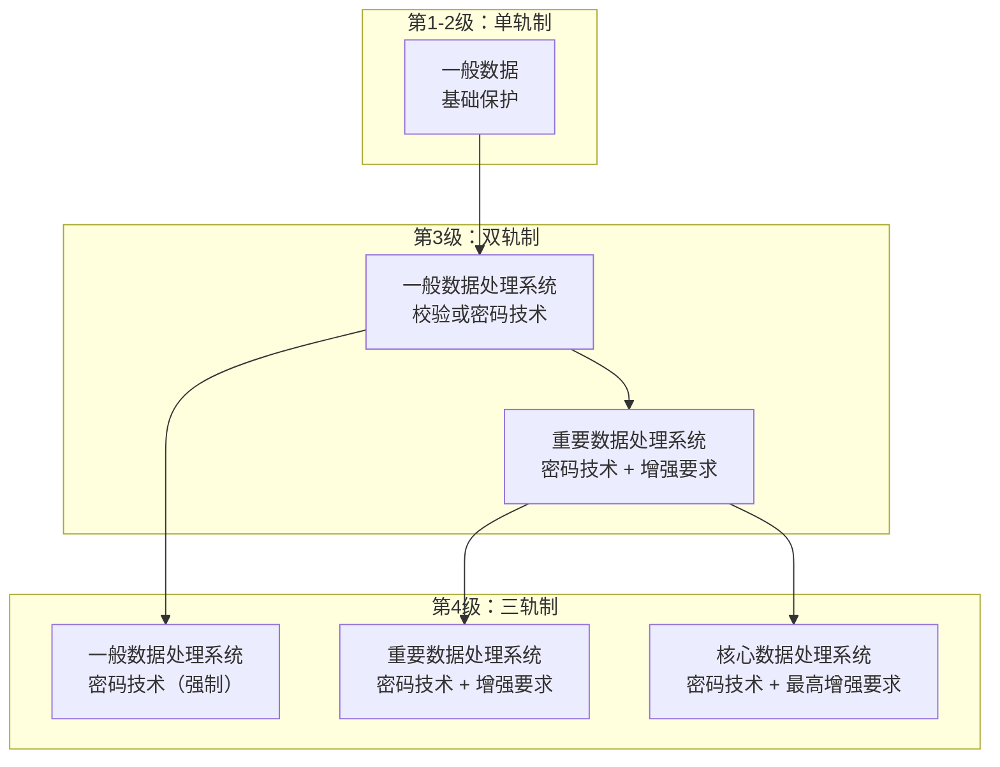

| 维度 | 一般数据轨道 | 重要数据轨道 | 核心数据轨道 |
|------|------------|------------|------------|
| **启用等级** | L1 | L3 | L4 |
| **完整性** | 校验→密码 | 密码技术 | 密码技术 |
| **保密性** | 必要措施→密码 | 密码技术 | 密码技术 |
| **身份鉴别** | 基本→组合 | 口令+密码 | 口令+密码+生物+动态 |
| **访问控制** | 接口→细粒度 | +全操作覆盖 | +动态细粒度 |
| **安全审计** | 操作审计 | +数据操作审计 | +数据操作审计 |
| **入侵防范** | — | 检测+报警 | +实时阻断+内容检测 |
| **剩余信息** | — | 通道清除+空间清除 | 通道清除+空间清除 |
| **数据溯源** | 展示→源头+导出 | 展示+源头+导出 | +处理过程 |
| **抗抵赖** | — | — | ✓ |
| **跨境管控** | — | 识别+监测+管控 | 识别+监测+管控 |
| **态势感知** | — | — | ✓ |

### 6.4 等级间要求继承关系

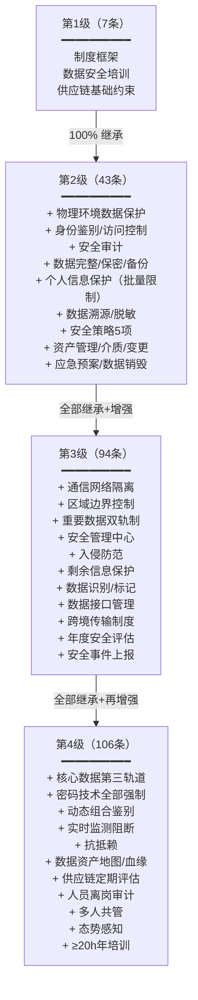

---

## 七、逐级详细拆解

### 7.1 第1级（自主保护级）

> 🟢 **基础要求** | 7 条 COU | 权重 2.8~4.0 | 覆盖 7 个安全域

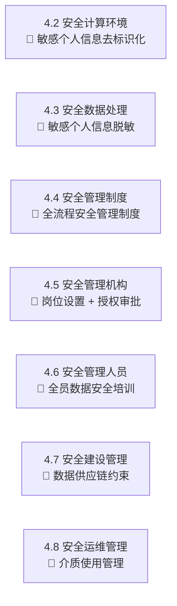

#### 4.2 安全计算环境（1条）

| COU ID | 条款 | 动作 | 权重 |
|--------|------|:--:|:--:|
| `COU-R-2380-L1-4.2-X` | 如需要在开发环境、测试环境使用个人信息，应对其中的敏感个人信息进行去标识化 | 应 | 4.0 |

#### 4.3 安全数据处理（1条）

| COU ID | 条款 | 动作 | 权重 |
|--------|------|:--:|:--:|
| `COU-R-2380-L1-4.3-X` | 应根据法律法规的相关规定和个人信息的使用目的，在界面展示环节对敏感个人信息进行脱敏 | 应 | 4.0 |

#### 4.4 安全管理制度（1条）

| COU ID | 条款 | 动作 | 权重 |
|--------|------|:--:|:--:|
| `COU-R-2380-L1-4.4-X` | 应制定覆盖全流程数据处理活动的安全管理制度 | 应 | 4.0 |

#### 4.5 安全管理机构（2条）

| COU ID | 条款 | 动作 | 权重 |
|--------|------|:--:|:--:|
| `COU-R-2380-L1-4.5.1-X` | 宜设立数据库管理员岗位，定义岗位的职责 | 宜 | 2.8 |
| `COU-R-2380-L1-4.5.2-X` | 宜明确数据处理授权审批事项、审批部门、审批人等 | 宜 | 2.8 |

#### 4.6 安全管理人员（1条）

| COU ID | 条款 | 动作 | 权重 |
|--------|------|:--:|:--:|
| `COU-R-2380-L1-4.6-X` | 应对全员开展数据安全培训，加强数据安全保护意识教育 | 应 | 4.0 |

#### 4.7 安全建设管理（1条）

| COU ID | 条款 | 动作 | 权重 |
|--------|------|:--:|:--:|
| `COU-R-2380-L1-4.7-X` | 应采取措施约束数据供应链相关方对数据的收集、使用、提供符合国家法律法规要求 | 应 | 4.0 |

#### 4.8 安全运维管理（1条）

| COU ID | 条款 | 动作 | 权重 |
|--------|------|:--:|:--:|
| `COU-R-2380-L1-4.8-X` | 应规范介质使用管理，避免介质内数据被违规留存或还原 | 应 | 4.0 |

---

### 7.2 第2级（指导保护级）

> 🟡 **增强要求** | 43 条 COU | 权重 4.2~6.0 | 覆盖 25 个子域

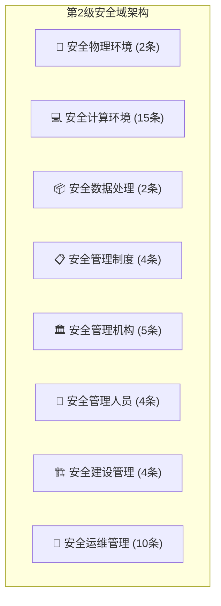

#### 5.2 安全物理环境（2条）

| COU ID | 条款 | 动作 | 权重 |
|--------|------|:--:|:--:|
| `COU-R-2380-L2-5.2.1-X` | 应采取校验技术保护电子门禁系统物理访问控制记录数据、视频监控数据在存储过程中的完整性 | 应 | 6.0 |
| `COU-R-2380-L2-5.2.2-X` | 应采取校验技术保护机房环境监测数据在存储过程中的完整性 | 应 | 6.0 |

#### 5.3 安全计算环境（15条）

##### 5.3.1 身份鉴别（2条）

| COU ID | 条款 | 动作 | 权重 |
|--------|------|:--:|:--:|
| `COU-R-2380-L2-5.3.1-a` | 宜对登录的程序或应用进行身份标识和鉴别，身份鉴别信息具有复杂度要求并定期更换 | 宜 | 4.2 |
| `COU-R-2380-L2-5.3.1-b` | 应能对系统中运行的数据处理工具进行身份鉴别 | 应 | 6.0 |

##### 5.3.2 访问控制（4条）

| COU ID | 条款 | 动作 | 权重 |
|--------|------|:--:|:--:|
| `COU-R-2380-L2-5.3.2-a` | 应在通信前对参与数据流动的内外部接口进行授权 | 应 | 6.0 |
| `COU-R-2380-L2-5.3.2-b` | 应对数据源和数据存储系统的访问，以及数据导入导出、数据备份和恢复等操作采取访问控制措施 | 应 | 6.0 |
| `COU-R-2380-L2-5.3.2-c` | 应定期对数据处理全流程使用的各类账号进行识别、梳理及分类，防止非法账号、闲置账号、过期账号存在 | 应 | 6.0 |
| `COU-R-2380-L2-5.3.2-d` | 应对数据处理活动使用的数据收集、数据脱敏、数据共享、数据发布、数据销毁等工具的访问、操作和运行进行权限控制 | 应 | 6.0 |

##### 5.3.3 安全审计（1条）

| COU ID | 条款 | 动作 | 权重 |
|--------|------|:--:|:--:|
| `COU-R-2380-L2-5.3.3-a` | 应对数据收集、存储、使用、加工、传输、提供、公开、销毁等数据处理活动的重要操作过程和安全事件进行安全审计 | 应 | 6.0 |

##### 5.3.4~5.3.8 其他（7条）

| COU ID | 子域 | 条款摘要 | 动作 | 权重 |
|--------|------|---------|:--:|:--:|
| `COU-R-2380-L2-5.3.4-X` | 恶意代码防范 | 在数据收集、存储、使用和加工环节进行恶意代码检测和防范 | 应 | 6.0 |
| `COU-R-2380-L2-5.3.5-X` | 数据完整性 | 采用校验技术保护数据在传输过程中的完整性（鉴别/业务/审计/配置/溯源/个人信息等） | 应 | 6.0 |
| `COU-R-2380-L2-5.3.6-X` | 数据保密性 | 采取必要措施保护鉴别数据在存储和网络传输过程中的保密性 | 应 | 6.0 |
| `COU-R-2380-L2-5.3.7-a` | 数据备份恢复 | 提供异地数据备份功能，利用通信网络将重要数据定时批量备份至备份场地 | 应 | 6.0 |
| `COU-R-2380-L2-5.3.7-b` | 数据备份恢复 | 支持选择全部或部分备份数据，及不同备份时间点的备份数据进行恢复 | 应 | 6.0 |
| `COU-R-2380-L2-5.3.7-c` | 数据备份恢复 | 确保数据恢复过程中的完整性，在检测到完整性破坏时采取必要恢复措施 | 应 | 6.0 |
| `COU-R-2380-L2-5.3.8-b` | 个人信息保护 | 应对个人信息批量查询、高频次查询进行限制 | 应 | 6.0 |

#### 5.4~5.9 其余安全域（26条）

| 章节 | 安全域 | 条款数 | 代表性要求 |
|------|--------|:----:|-----------|
| 5.4.1 | 数据溯源 | 1 | 宜采取技术措施（如水印技术）实现敏感数据展示可追溯性 |
| 5.4.2 | 数据脱敏 | 1 | 根据使用目的采取相应脱敏技术/规则/策略 |
| 5.5.1 | 安全策略 | 2 | 制定总体方针和安全策略；依据分类分级建立业务规则策略 |
| 5.5.2 | 管理制度 | 2 | 制定覆盖全流程的管理制度；建立日常管理操作规程 |
| 5.6.1 | 岗位设置 | 1 | 设立数据安全负责人、管理员、审计员等关键岗位 |
| 5.6.2 | 授权和审批 | 3 | 明确审批事项/部门/人；数据收集审查审批；加工/共享/销毁审批 |
| 5.6.3 | 审核和检查 | 1 | 开展日常数据安全检查 |
| 5.7.1 | 人员录用 | 1 | 签署保密协议并通过数据安全考试 |
| 5.7.2 | 安全培训 | 1 | 对全员开展数据安全培训 |
| 5.7.3 | 外部人员管理 | 1 | 外部人员接入受控网络前书面/电子申请，审批后开设账户 |
| 5.8 | 安全建设管理 | 4 | 供应链约束；供应链安全规范；数据提供方身份审核；合作协议签署 |
| 5.9.1 | 资产管理 | 3 | 建立资产管理制度；编制资产清单；数据标识管理 |
| 5.9.2 | 介质管理 | 2 | 介质使用管理；存储介质标记和审计 |
| 5.9.3 | 变更管理 | 2 | 资产变更方案评审批准；变更记录通知 |
| 5.9.4 | 应急预案管理 | 1 | 建立数据安全事件应急响应机制 |
| 5.9.5 | 数据销毁 | 2 | 建立销毁制度和审批机制 |

---

### 7.3 第3级（监督保护级）

> 🟠 **重要数据保护级** | 94 条 COU | 权重 5.6~8.0 | 覆盖 32 个子域

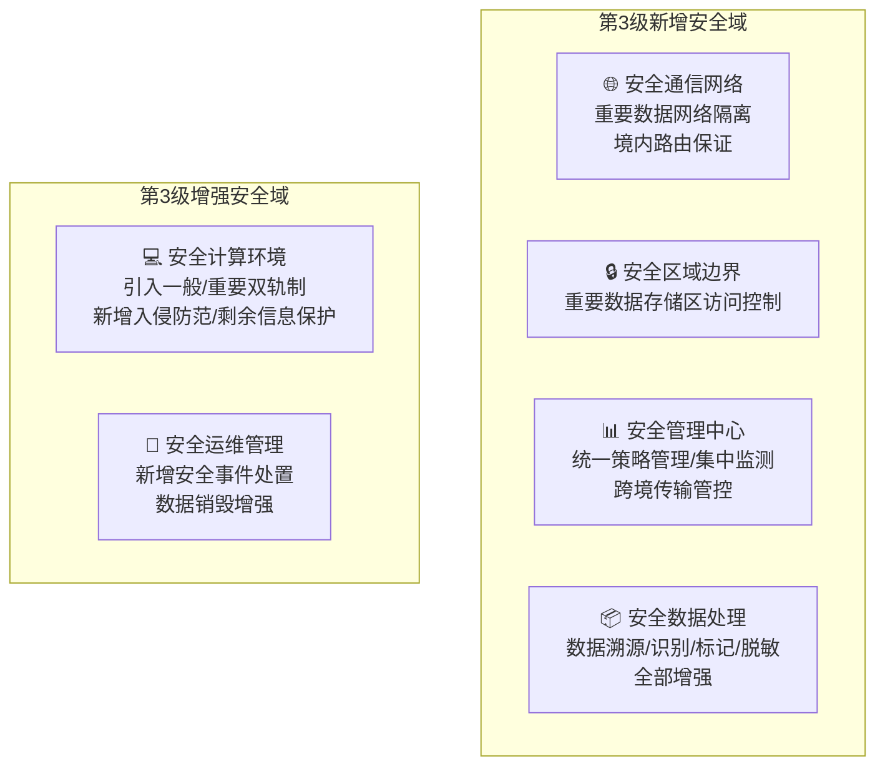

#### 6.2 安全物理环境（3条，技术升级）

| COU ID | 条款 | 动作 | 权重 |
|--------|------|:--:|:--:|
| `COU-R-2380-L3-6.2.1-a` | 应采用校验技术或密码技术保护电子门禁/视频监控数据在传输和存储过程中的完整性 | 应 | 8.0 |
| `COU-R-2380-L3-6.2.1-b` | 应采用密码技术保护电子门禁系统的鉴别数据和生物特征信息的保密性 | 应 | 8.0 |
| `COU-R-2380-L3-6.2.2-X` | 应采用校验技术或密码技术保护机房环境监测数据在传输和存储过程中的完整性 | 应 | 8.0 |

#### 6.5 安全计算环境（26条，核心增强）

| 子域 | COU 数 | 关键变化（vs 第2级） |
|------|:------:|-------------------|
| 6.5.1 身份鉴别 | 4 | 工具账户与使用者账户分别鉴别；统一登录管理平台；口令+密码组合 |
| 6.5.2 访问控制 | 7 | 新增数据访问接口/服务调用控制；基于分类分级的细粒度策略；统一权限管理平台 |
| 6.5.3 安全审计 | 2 | 新增数据访问接口/服务调用审计 |
| 6.5.4 入侵防范 | 2 | **新增**：入侵检测+阻断报警；行为分析+异常检测 |
| 6.5.5 恶意代码防范 | 1 | 数据收集/存储/使用/加工环节 |
| 6.5.6 数据完整性 | 3 | 校验技术**或密码技术**；传输+存储双重保护；定期完整性检测 |
| 6.5.7 数据保密性 | 3 | **密码技术**保护重要/敏感数据传输和存储；不可逆销毁技术 |
| 6.5.8 数据备份恢复 | 3 | **实时备份**（非定时）；结构化/非结构化分别制定恢复策略 |
| 6.5.9 剩余信息保护 | 2 | **新增**：导入导出通道缓存清除；存储空间释放前完全清除 |
| 6.5.10 个人信息保护 | 2 | 新增分开存储（恢复识别信息/去标识化信息、生物识别/身份信息） |

#### 6.6 安全数据处理（9条，全新能力）

| 子域 | COU 数 | 关键要求 |
|------|:------:|---------|
| 6.6.1 数据溯源 | 3 | 展示溯源（水印）+ 数据源头溯源（标记/血缘）+ 导出共享溯源（水印/签名） |
| 6.6.2 数据识别 | 2 | 网络边界识别流出数据；存储中识别结构化重要/敏感数据 |
| 6.6.3 数据标记 | 2 | 结构化数据元数据/类别级别/数据源标记；敏感个人信息标记 |
| 6.6.4 数据脱敏 | 2 | 根据使用目的脱敏；静态/动态脱敏（开发测试/分析/应用/交换）；静态脱敏后分库存储 |

#### 6.7 安全管理中心（6条）

| COU ID | 条款 | 动作 | 权重 |
|--------|------|:--:|:--:|
| `COU-R-2380-L3-6.7.1-a` | 应对数据的分类分级、溯源、脱敏、访问控制等数据安全策略进行统一管理 | 应 | 8.0 |
| `COU-R-2380-L3-6.7.1-b` | 应对收集、存储、加工、使用、提供、公开等处理活动的数据资产进行统一管理 | 应 | 8.0 |
| `COU-R-2380-L3-6.7.1-c` | 应对数据流转情况、处理进程运行状况、数据存储空间等进行集中监测 | 应 | 8.0 |
| `COU-R-2380-L3-6.7.1-d` | 应对数据导入导出接口进行流量过载监测，确保海量数据导入导出安全可控 | 应 | 8.0 |
| `COU-R-2380-L3-6.7.2-a` | 应集中监测用户/程序对重要数据的访问和操作，针对越权/高频/恶意操作实时告警 | 应 | 8.0 |
| `COU-R-2380-L3-6.7.2-b` | 应对重要数据跨境传输业务进行识别、监测和管控 | 应 | 8.0 |

#### 6.8~6.12 其余安全域汇总

| 章节 | 安全域 | 条款数 | L3 新增/增强要点 |
|------|--------|:----:|-----------------|
| 6.8.1 | 安全策略 | 3 | 新增数据安全战略规划 |
| 6.8.2 | 管理制度 | 5 | 新增数据接口全生命周期管理；接口安全控制策略；跨境传输管理制度；重要数据风险评估制度 |
| 6.9.1 | 岗位设置 | 2 | 明确数据安全管理职能部门；落实数据安全保护责任 |
| 6.9.2 | 授权和审批 | 6 | 审批内容细化（数据量/交接方式/加工深度/安全性）；对外提供/跨境需安全评估；重要数据逐次审批；高风险操作多层级审批 |
| 6.9.3 | 审核和检查 | 4 | 新增定期安全检查；安全检查表格和报告；年度数据安全评估（报告留存≥3年） |
| 6.10.1 | 人员录用 | 2 | 新增岗位责任协议；重要数据岗前背景审查；定期评估考核 |
| 6.10.3 | 培训 | 3 | 新增培训计划、人力资源考核制度和问责机制 |
| 6.10.4 | 外部人员管理 | 2 | 新增保密协议签署要求 |
| 6.11 | 安全建设管理 | 5 | 新增数据供应链目录和字典管理 |
| 6.12.1 | 资产管理 | 5 | 工具化资产识别；重要数据清单管理程序；技术工具分类分级标识 |
| 6.12.2 | 介质管理 | 3 | 新增介质销毁操作过程记录 |
| 6.12.3 | 变更管理 | 3 | 新增变更控制程序（6类重要环节）；变更触发安全风险评估 |
| 6.12.4 | 安全事件处置 | 1 | **新增**：重要数据/10万人以上个人信息泄露上报+调查评估报告 |
| 6.12.5 | 应急预案管理 | 2 | 应急预案需明确组织机构/监测工具/处置流程/保障措施 |
| 6.12.6 | 数据销毁 | 2 | 介质销毁采用重复清除与覆盖等难以恢复的方法 |

---

### 7.4 第4级（强制保护级）

> 🔴 **核心数据 + 重要数据保护级** | 106 条 COU | 权重 7.0~10.0 | 覆盖 33 个子域

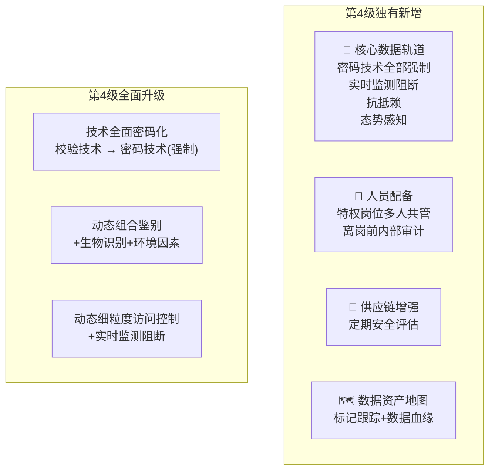

#### 7.5 安全计算环境（31条，全密码技术 + 三轨制）

| 子域 | COU 数 | 关键变化（vs 第3级） |
|------|:------:|-------------------|
| 7.5.1 身份鉴别 | 5 | 新增**动态组合鉴别策略**（口令+密码+生物识别+IP+时间+终端+行为） |
| 7.5.2 访问控制 | 9 | 新增**动态细粒度访问控制**（主体身份/鉴别方式/环境/行为/敏感性） |
| 7.5.3 安全审计 | 2 | — |
| 7.5.4 入侵防范 | 4 | **核心数据新增**：跨主体传输实时监测+内容检测+实时阻断；接口/服务盗用滥用检测 |
| 7.5.5 恶意代码防范 | 1 | 新增"防止收集、执行恶意数据" |
| 7.5.6 数据完整性 | 5 | **新增抗抵赖**：密码技术提供数据原发证据和接收证据 |
| 7.5.7 数据保密性 | 4 | 核心数据纳入保护范围；新增**密文计算**（第三方处理时始终密文形态） |
| 7.5.8 数据备份恢复 | 3 | — |
| 7.5.9 剩余信息保护 | 2 | 核心数据纳入空间清除范围 |
| 7.5.10 个人信息保护 | 2 | — |

#### 7.6 安全数据处理（11条，非结构化全覆盖）

| 子域 | COU 数 | L4 增强 |
|------|:------:|--------|
| 7.6.1 数据溯源 | 3 | **处理过程溯源**（非仅数据源头） |
| 7.6.2 数据识别 | 3 | **结构化+非结构化**数据识别；自动化工具 |
| 7.6.3 数据标记 | 2 | **结构化和非结构化**数据标记 |
| 7.6.4 数据脱敏 | 2 | — |

#### 7.7 安全管理中心（8条，新增态势感知）

| 新增/增强 | 内容 |
|-----------|------|
| **态势展示** | 宜对数据的收集、处理、存储等活动的位置、操作、风险及威胁等进行展示 |
| **态势预测** | 宜监测、分析、预测数据安全整体态势 |
| **核心数据跨境管控** | 应对核心数据、重要数据跨境传输业务进行识别、监测和管控 |

#### 7.9~7.12 第4级独有新增

| 章节 | 新增要求 | COU 数 |
|------|---------|:------:|
| 7.9.2 人员配备 | 数据安全关键事务岗位（特权账户所有者、关键数据处理与交换岗位等）应配备**多人共同管理** | 1 |
| 7.10.2 人员离岗 | 应在数据安全关键岗位员工**离职前对其在职期间数据处理活动进行内部审计** | 1 |
| 7.10.3 培训 | 重要数据和核心数据处理相关的技术和管理人员**每年安全培训时间不少于20h** | 1 |
| 7.11 供应链 | 应**定期对数据供应链上下游**数据处理活动安全风险和数据安全管理能力进行**评估** | 1 |
| 7.12.1 资产管理 | 应建立**数据资产地图**，对特定数据对象进行标记和跟踪，构建和维护**数据血缘关系** | 1 |
| 7.12.6 数据销毁 | 采取重复清除、覆盖与**消磁、粉碎**等相结合的数据销毁方法 | 1 |

---

## 八、场景聚合视图

### 8.1 按数据处理环节场景

| 场景 | COU 数 | 覆盖等级 | 关键要求摘要 |
|------|:------:|---------|-------------|
| **数据处理全流程** | 105 | L1~4 | 制度覆盖、安全审计、供应链约束、账号管理 |
| **数据使用** | 51 | L1~4 | 访问控制、脱敏、身份鉴别、溯源、权限控制 |
| **数据存储** | 41 | L2~4 | 保密性（密码技术）、完整性（校验→密码）、标记、访问控制 |
| **数据收集** | 27 | L2~4 | 溯源（标记/血缘）、识别、恶意代码防范、供应链审核 |
| **数据提供** | 20 | L2~4 | 授权审批、溯源（水印/签名）、供应链安全、安全评估 |
| **数据销毁** | 19 | L2~4 | 不可逆销毁（清除/覆盖/消磁/粉碎）、审批、记录 |
| **数据识别** | 19 | L3~4 | 结构化→结构化+非结构化、网络边界识别、自动化工具 |
| **数据传输** | 16 | L2~4 | 完整性、保密性、网络隔离、境内路由保证 |
| **数据溯源** | 16 | L2~4 | 水印（隐藏性/健壮性/安全性）、标记、血缘分析、签名 |
| **数据备份** | 16 | L2~4 | 异地备份（定时→实时）、完整性校验、溯源数据同步备份 |
| **数据脱敏** | 15 | L1~4 | 静态脱敏/动态脱敏、场景化（开发测试/分析/应用/交换）、分库存储 |
| **数据加工** | 15 | L2~4 | 审批（可能改变用途时评估）、恶意代码防范、识别 |
| **数据恢复** | 14 | L2~4 | 完整性校验、结构化（回滚+文件恢复）/非结构化（日志+文件系统恢复） |
| **数据导出** | 13 | L2~4 | 溯源（水印/签名）、访问控制、审批、通道缓存清除 |
| **数据导入** | 13 | L2~4 | 完整性（密码技术保护外部导入）、访问控制、流量过载监测 |
| **数据公开** | 12 | L2~4 | 授权审批（含安全评估）、安全检查 |
| **数据标记** | 10 | L3~4 | 元数据/类别级别/数据源标记、保护标记不被非授权修改 |
| **数据共享** | 10 | L2~4 | 溯源、审批、水印技术 |
| **数据交换** | 8 | L2~4 | 安全审计、审批、接口安全控制 |
| **数据删除** | 1 | L3~4 | 个人信息注销后删除/匿名化处理 |

### 8.2 按数据分类场景

| 数据分类 | 涉及等级 | COU 数 | 核心保护要求 |
|---------|---------|:------:|-------------|
| **核心数据** | L4 | ~15 | 密码技术全覆盖；动态细粒度访问控制；实时监测阻断；抗抵赖；态势感知；消磁+粉碎销毁 |
| **重要数据** | L3~4 | ~35 | 密码技术保护传输和存储；双轨制管理；网络隔离；跨境监测管控；年度评估；安全事件上报 |
| **敏感数据** | L2~4 | ~25 | 脱敏；溯源（水印）；数据标记；加密传输；访问控制；导入导出控制 |
| **敏感个人信息** | L1~4 | ~10 | 去标识化；分开存储；批量查询限制；限期保存；注销删除 |
| **一般数据** | L1~4 | ~165 | 基础制度管理；校验→密码技术保护；定期安全检查 |

---

## 九、跨标准关联分析

### 9.1 与 GB/T 22239—2019 的关系

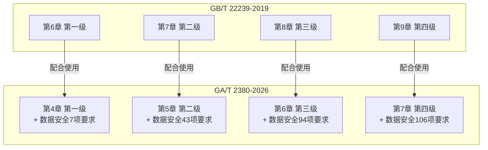

| 关联维度 | 说明 |
|---------|------|
| **关系定位** | GA/T 2380 是 GB/T 22239 在数据安全领域的**增强和细化**，需配合使用 |
| **等级对应** | 第1~4级一一对应，第5级均略 |
| **继承关系** | 每个等级"除应满足 GB/T 22239 第X章要求外，还应满足……" |
| **安全域扩展** | 新增独立"安全数据处理"域（溯源/识别/标记/脱敏） |
| **技术升级** | GB/T 22239 的技术要求（如访问控制、安全审计）在 GA/T 2380 中被数据安全化增强 |

### 9.2 引用的其他规范性文件

| 引用标准 | 在本标准中的作用 |
|---------|----------------|
| **GB/T 43697—2024** 数据分类分级规则 | 定义重要数据、核心数据、一般数据 |
| **GB/T 45574—2025** 敏感个人信息处理安全要求 | 敏感个人信息处理规范 |
| **GB/T 22240—2020** 等级保护定级指南 | 等级保护对象定级 |
| **GB 17859—1999** 计算机信息系统安全保护等级划分准则 | 等级划分基础 |
| **GB/T 25069—2022** 信息安全技术 术语 | 基础术语 |

---

## 十、合规优先级矩阵

### 10.1 高优先级合规项（权重 ≥ 9.0）

| 排名 | COU ID | 要求 | 权重 | 数据分类 |
|:----:|--------|------|:----:|---------|
| 1 | `COU-R-2380-L4-7.5.1-b` | 应采用口令和密码技术组合的鉴别技术对核心数据、重要数据和敏感数据处理程序或应用进行身份鉴别 | 10.0 | 核心/重要/敏感 |
| 2 | `COU-R-2380-L4-7.5.2.2-b` | 应能根据主体身份、鉴别方式、访问环境、访问行为、操作敏感性等因素，实现动态、细粒度的访问控制 | 10.0 | 核心/重要 |
| 3 | `COU-R-2380-L4-7.5.4.2-a` | 应采取技术措施对跨主体数据传输进行实时监测和内容检测，发现数据异常传输行为时进行实时阻断 | 10.0 | 核心 |
| 4 | `COU-R-2380-L4-7.5.6.2-b` | 应采用密码技术提供数据原发证据和数据接收证据，实现抗抵赖 | 10.0 | 核心/重要 |
| 5 | `COU-R-2380-L4-7.5.7-a` | 应采用密码技术保护核心数据、重要数据和敏感数据及其备份数据在远程导入及传输过程的保密性 | 10.0 | 核心/重要/敏感 |
| 6 | `COU-R-2380-L4-7.5.7-b` | 应采用密码技术保护核心数据、重要数据和敏感数据在存储过程中的保密性 | 10.0 | 核心/重要/敏感 |
| 7 | `COU-R-2380-L4-7.7.2-b` | 应对核心数据、重要数据跨境传输业务进行识别、监测和管控 | 10.0 | 核心/重要 |
| 8 | `COU-R-2380-L4-7.9.2-X` | 数据安全关键事务岗位应配备多人共同管理 | 10.0 | 全部 |
| 9 | `COU-R-2380-L3-6.5.7-a` | 应采用密码技术保护重要数据和敏感数据及其备份数据在传输过程的保密性 | 8.0 | 重要/敏感 |
| 10 | `COU-R-2380-L3-6.7.2-b` | 应对重要数据跨境传输业务进行识别、监测和管控 | 8.0 | 重要 |

### 10.2 合规难度矩阵（估算）

| 安全域 | 技术难度 | 管理难度 | 综合难度 | 说明 |
|--------|:------:|:------:|:------:|------|
| 动态细粒度访问控制 | ⭐⭐⭐⭐⭐ | ⭐⭐⭐ | 🔴 极高 | 多因素实时计算，工程复杂度高 |
| 数据加密（存储+传输） | ⭐⭐⭐⭐ | ⭐⭐ | 🔴 高 | 密钥管理体系、性能影响 |
| 数据溯源（全链路） | ⭐⭐⭐⭐ | ⭐⭐⭐ | 🔴 高 | 血缘分析 + 水印 + 签名全覆盖 |
| 入侵检测阻断（实时） | ⭐⭐⭐⭐ | ⭐⭐⭐ | 🔴 高 | 实时内容检测 + 自动阻断 |
| 数据识别（非结构化） | ⭐⭐⭐⭐ | ⭐⭐ | 🟠 中高 | NLP/ML 能力要求 |
| 态势感知 | ⭐⭐⭐⭐ | ⭐⭐ | 🟠 中高 | 大数据分析能力 |
| 抗抵赖 | ⭐⭐⭐ | ⭐⭐ | 🟡 中 | PKI 基础设施 |
| 数据资产地图/血缘 | ⭐⭐⭐ | ⭐⭐⭐ | 🟡 中 | 工具化建设 |
| 数据脱敏（静/动态） | ⭐⭐⭐ | ⭐⭐ | 🟡 中 | 场景适配 |
| 安全管理制度体系 | ⭐ | ⭐⭐⭐⭐ | 🟢 中低 | 组织体系建设 |
| 数据分类分级 | ⭐⭐ | ⭐⭐⭐⭐ | 🟡 中 | 业务理解 + 技术实施 |
| 供应链安全评估 | ⭐ | ⭐⭐⭐⭐ | 🟢 中低 | 流程建设 |

---

## 十一、输出文件索引

### 11.1 文件清单

| 类型 | 路径 | 数量/大小 | 说明 |
|------|------|----------|------|
| 📊 **拆解报告** | `GAT2380-2026_拆解报告.md` | ~65 KB | 本完整报告（含全部可视化图表） |
| 📋 **提取脚本** | `cou_extract_gat2380.py` | ~15 KB | 可复用 COU 提取脚本 |
| 📁 **COU-R 原始库** | `COU-R/` | 227 文件 | 每条合规义务独立 .md（含 frontmatter + 指纹） |
| 🔗 **场景聚合** | `场景/` | 24 文件 | 按数据环节 + 等级聚合 |
| 💾 **SaaS 导出** | `GAT2380-2026_COU_export.json` | 250 KB | 完整结构化 JSON（250 条） |

### 11.2 COU-R 文件命名规范

```
COU-R-2380-L{等级}-{章节}-{条款}.md
```

| 命名元素 | 含义 | 示例 |
|---------|------|------|
| `2380` | 标准编号 | GA/T 2380 |
| `L1` ~ `L4` | 安全保护等级 | L3 = 第3级 |
| `6.5.1` | 标准章节号 | 第6章第5.1节 |
| `a` ~ `g` 或 `X` | 条款字母编号，X=无编号 | a = 条款a |

---

> 📅 **报告生成日期**：2026-06-16
> 📄 **标准状态**：报批稿（GA/T XXXX—XXXX）
> 🛠️ **拆解工具**：EZcompliance COU 方法论 v2
> ✅ **覆盖完整性**：已覆盖第1~4级全部要求（第5级为"略"），共提取 **250 条合规义务单元**
